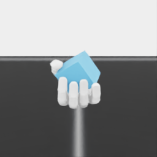

# Visual reorientation camera

The visual semantic task uses one fixed eye-to-hand RGB-D camera.  Its pose is
defined in
`source/BrainCo_DexHand/BrainCo_DexHand/tasks/direct/brainco/brainco_hand_visual_semantic_reorient_env_cfg.py`:

| quantity | value |
| --- | --- |
| position (world frame) | `(0.00, -0.72, 0.95) m` |
| orientation | OpenGL convention; `+57.4074°` about X; quaternion `(w,x,y,z)=(0.87711507, 0.48028028, 0, 0)` |
| image size | `256 × 256` RGB + metric depth |
| focal length / aperture | `40 mm` / `20.955 mm` |
| approximate horizontal field of view | `29.4°` |

The hand/object is around `(0, -0.11, 0.56) m` at reset.  Therefore this
camera is geometrically aimed at the reset object center from the front and
above, 32.5926° below the horizon. Isaac Lab's OpenGL camera points along -Z;
its `world` convention instead points along +X. The quaternion above must be
used with `convention="opengl"`.

On 2026-09-12, the standalone Docker environment rendered the real Revo3 scene
on an RTX 5060 Laptop GPU (driver 570.211.01). RGB and metric depth were valid,
and all six target-face rotations and repeated one-hot resets passed checks.
The sample below shows the cube and fingers in the camera frame. Goal-debug
geometry is hidden from the sensor. Initial 128×128 / 28 mm images made the
object too small; the present framing is more suitable for subsequent markers.

This is one sensor smoke, not a visibility benchmark or proof of a better pose
than overhead cameras. The cube currently has no actual semantic markers, and
neither teacher performance on this primitive cube nor readable markings across
grasp states has been established. Those checks precede data collection.

Prior work provides examples of sensor arrangements rather than this exact
pose: *Learning dexterous in-hand manipulation* (OpenAI/Shadow Hand, distinct
from HORA) used three RGB cameras; *Visual Dexterity* used a single commodity
depth camera. *ViserDex* studies monocular RGB reorientation. None of these
references establishes the coordinates above as optimal for Revo3.

The pose is kept fixed during data collection so that viewpoint is not a hidden
source of supervision.  Camera randomization should be introduced only as a
separate robustness experiment (small azimuth/elevation/roll perturbations),
and the exact pose should be recorded with every dataset version.

References:

- [Learning dexterous in-hand manipulation](https://doi.org/10.1177/0278364919887447)
- [Visual Dexterity: In-Hand Reorientation](https://arxiv.org/abs/2211.11744)
- [ViserDex: Visual Sim-to-Real for Robust Dexterous In-hand Reorientation](https://arxiv.org/abs/2604.11138)
